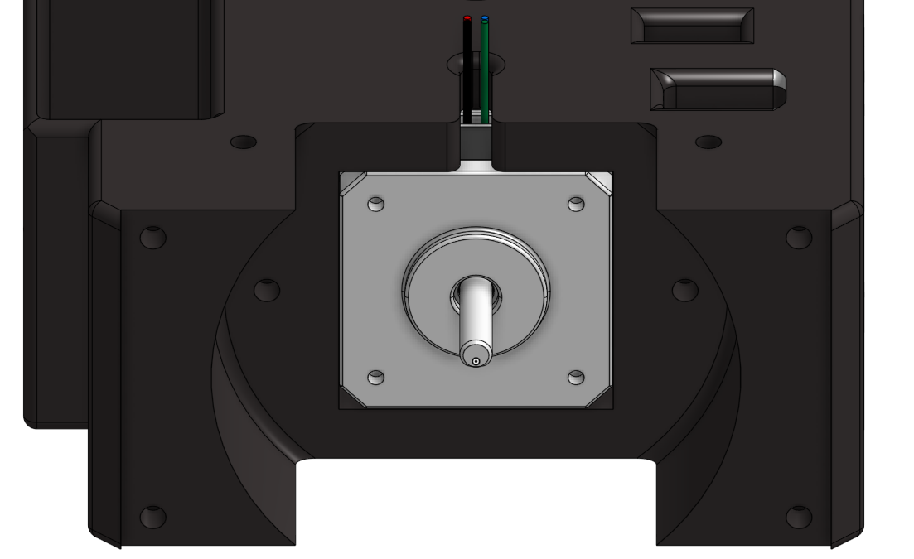
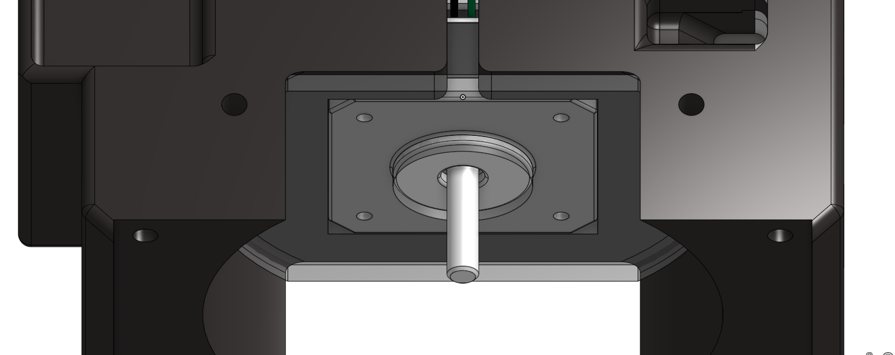
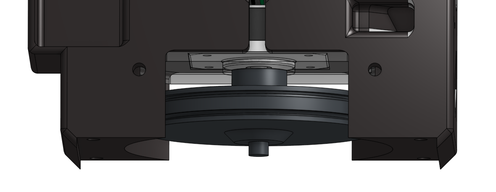
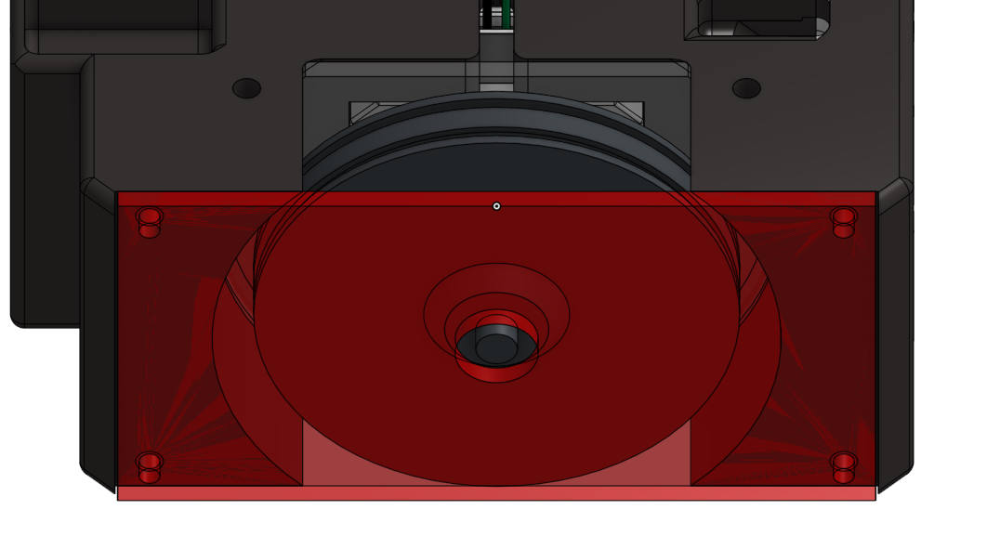

# La mécanique des PAMIs

La mécanique des PAMIs s’appuie sur plusieurs éléments essentiels qui travaillent ensemble pour assurer leur déplacement, leur autonomie et leur sécurité pendant le match. Voici leur fonctionnement organisé de façon logique :

## 1. La tirette de démarrage
La tirette est un élément clé qui déclenche le début du match. En la retirant, on lance le code de contrôle du PAMI, ce qui active son fonctionnement. C’est un dispositif de sécurité important pour éviter tout démarrage intempestif.
 

### Comment ça fonctionne ?

#### 1. Composants utilisés
🔹 Un aimant : fixé sur une "tirette" (petite languette ou support que tu peux retirer à la main).

🔹 Un capteur magnétique : souvent un capteur à effet Hall ou un reed switch, placé sur le robot.

#### 2. Principe
🔹 Quand l’aimant est proche du capteur, celui-ci détecte le champ magnétique.

🔹 L’état du capteur est alors actif (souvent une tension logique "1" ou "0", selon le montage).

🔹 Quand on retire la tirette (donc l’aimant), le champ magnétique disparaît.

🔹 Le capteur détecte ce changement et déclenche une action dans le programme, typiquement :
 → Lancement du robot, démarrage du code, mise sous tension, etc.

## 2. Le bouton d’arrêt d’urgence
Le bouton d’arrêt d’urgence (BAU) est un dispositif de sécurité obligatoire sur tous les robots et PAMI. Il permet de couper immédiatement l’alimentation du système en cas de danger ou de dysfonctionnement. Il fonctionne comme un interrupteur mécanique : lorsqu’on appuie dessus, le circuit électrique est interrompu.

### Comment ça fonctionne ?
Dans notre cas, on l’utilise aussi comme interrupteur principal :

🔹 Lorsqu’il est enfoncé (position d’arrêt), le PAMI n’est pas alimenté.

🔹 Pour le démarrer, on relève le bouton d’arrêt d’urgence (on “lève le BAU”), ce qui libère le courant et alimente le système.

🔹 En fin d’utilisation ou pour l’arrêter rapidement, on appuie à nouveau sur le bouton pour le couper.

C’est donc à la fois un mécanisme de sécurité et un interrupteur de mise sous tension dans notre configuration.

## 3. Le switch de sélection d’équipe
Un petit interrupteurqui  permet de sélectionner la couleur de l’équipe (bleu ou jaune). Cette sélection influence le comportement du PAMI en choisissant, dans le code, la stratégie adaptée à l’équipe.

## 4. L’alimentation et la batterie
Une batterie compacte qui fournit l’énergie nécessaire à tous les composants : moteurs, servomoteurs, capteurs. C’est grâce à cette source d’énergie que le PAMI peut fonctionner de façon autonome.

## 5. Les roues
Les PAMIs sont équipés de deux roues motrices, placées au centre du robot, de part et d’autre de son châssis. Cette position centrale permet d’assurer un bon équilibre.
En effet, si les roues étaient placées trop à l’arrière, le robot aurait tendance à pencher vers l’avant, et inversement s’il était trop à l’avant. En les positionnant au centre, on évite ce déséquilibre, ce qui garantit une meilleure stabilité lors des déplacements.

<model-viewer alt="PAMI" src="./FichiersGLTF/roue.glb" ar style="width:80%; height:400px" shadow-intensity="1" camera-controls min-field-of-view="2deg"></model-viewer>

## 6. Les moteurs pas à pas (NEMA 17)
Chaque roue est entraînée par un moteur pas à pas de type NEMA 17. Ces moteurs sont particulièrement adaptés aux déplacements précis, car ils permettent un contrôle angulaire très peécis. Cela rend le robot capable d’effectuer des mouvements maîtrisés, ce qui est essentiel pour se déplacer.

<model-viewer alt="PAMI" src="./FichiersGLTF/moteur.gltf" ar style="width:80%; height:400px" shadow-intensity="1" camera-controls min-field-of-view="2deg"></model-viewer>

### 🧩 Assemblage de la roue et du moteur

🔧 Étapes de l’assemblage mécanique :

🔹 Le moteur pas à pas NEMA 17 est inséré dans une découpe latérale du bloc principal. Ce logement est parfaitement ajusté pour accueillir le moteur de façon stable.

🔹 Une plaque de fixation est ajoutée entre le moteur et le bloc afin de le maintenir en position. Elle est vissée dans le châssis pour empêcher tout mouvement du moteur.

🔹 La roue est fixée directement sur l’arbre du moteur via une vis. Elle est munie d’un roulement à billes en son centre, sur sa face extérieure.

🔹 Une seconde plaque, située de l’autre côté de la roue (côté extérieur), est fixe. Cette plaque accueille le roulement intégré à la roue : ainsi, la roue peut tourner librement grâce au roulement, tandis que la plaque reste immobile.

## 7. Le capteur ultrason
Monté à l’avant du PAMI, ce capteur infrason détecte les obstacles et les distances. Il permet d’adapter la trajectoire du PAMI pour éviter les collisions, aidant ainsi à la navigation autonome.

## 8. Les servomoteurs avant
Enfin, 2 petits servomoteurs sont situés à l’avant et serve a faire bouger un main pour réaliser l'action de danser.

