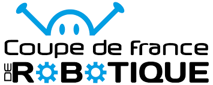

# Nos PAMIs

<model-viewer alt="PAMI" src="./Meca/FichiersGLTF/ExportPAMIUniWIP.glb" ar style="width:80%; height:400px" shadow-intensity="1" camera-controls min-field-of-view="2deg"></model-viewer>

## Qu'est-ce qu’un PAMI ?

Un PAMI, ou Petit Actionneur Mobile Indépendant, est un petit robot autonome utilisé en complément du robot principal pendant un match. Il peut être lancé au début ou en cours de partie, et il doit être capable de se déplacer par lui-même, même s’il peut être aidé ou contrôlé par les robots de son équipe pendant le match.

Comme les robots classiques, un PAMI doit respecter des règles strictes de sécurité et de construction : système d’arrêt d’urgence, détection d’obstacles, sécurité des batteries, etc. Il doit aussi pouvoir fonctionner quelle que soit la couleur de l’équipe.

Un PAMI ne suffit pas à lui seul pour homologuer une équipe, mais il doit être homologué pour avoir le droit de participer à un match. Si le robot principal ne peut pas rouler, les PAMIs peuvent quand même jouer seuls, à condition que tout soit homologué et que le robot principal soit present mas static.

## Quel est son role ?

Chaque année, les PAMIs ont des rôles différents, mais leur objectif reste le même : rapporter des points supplémentaires à l’équipe.

Pour cette édition, il existait deux types de PAMIs :

- La Superstar

    La Superstar devait monter sur la scène et avancer le plus loin possible dessus pour marquer un maximum de points. Une fois bien placée, elle pouvait activer un actionneur pour « danser ».

- Les Groupies

    Les Groupies, quant à elles, devaient se positionner dans des zones spécifiques situées juste devant la scène. Elles aussi pouvaient activer un actionneur pour effectuer une danse.

- Système de points lié aux PAMIs

    5 points sont accordés par Groupie présente dans la zone de fosse (devant la scène) à la fin du match.

    5 points supplémentaires sont donnés si la Superstar est sur la scène à la fin du match.

     Enfin, 10 points bonus sont attribués si tous les PAMIs dansent ensemble à la fin du match ("font la fête").

##  Contraintes techniques des PAMIs

En plus de leurs objectifs en match, les PAMIs doivent respecter un certain nombre de règles techniques précises imposées par le règlement.

Tous les PAMIs doivent :

- tenir au départ dans une zone de 150 mm par 450 mm commune à l’équipe,

- mesurer au moins 60 mm de côté, et pas plus de 150 mm de haut avant déploiement,

- avoir une zone dédiée de 30 mm × 30 mm pour coller l’autocollant du numéro de stand,

- peser au maximum 1,5 kg.

- Une fois lancés, les PAMIs peuvent se déployer, dans la limite d’une augmentation de 100 mm de périmètre, et évoluer jusqu’à 350 mm d’altitude.

- biensur ils doivent également être entièrement autonomes.

