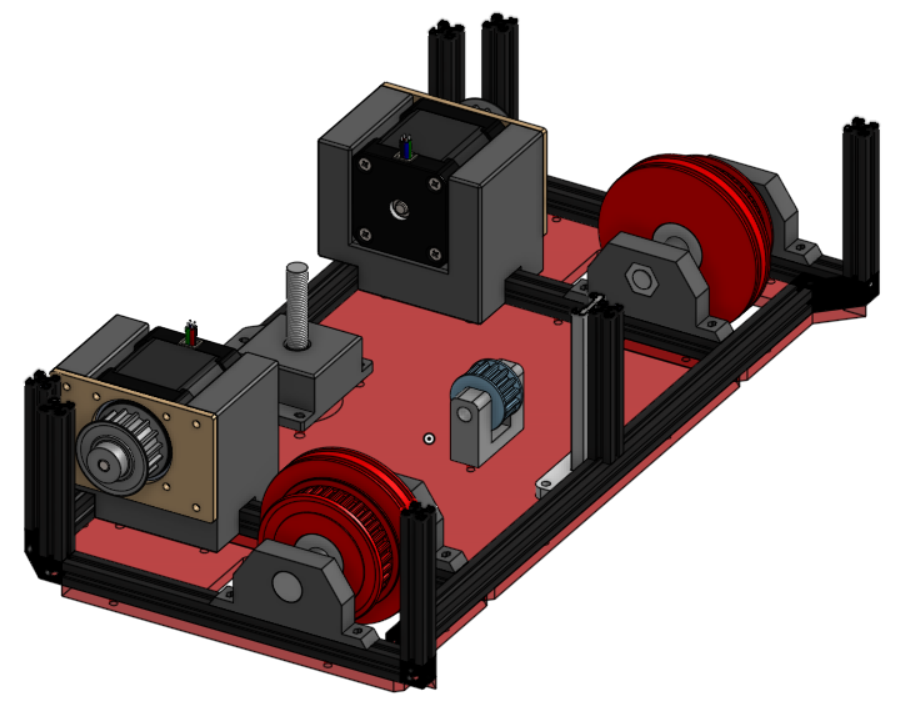
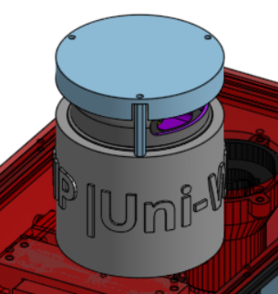

## Les déplacements 

Nous avons opté pour un robot différentiel afin de simplifier au maximum que ce soit la mécanique du robot ou sa programmation, propulsé par 2 NEMA 17 reliés aux roues par une courroie permettant d'augmenter la puissance.

---
## Les actionneurs

Pour accomplir au mieux les actions de jeu, le robot était équipé de deux actionneurs. 

### Les planches

L'actionneur chargé de soulever les planches avait été imaginé avec des ventouses. Celles-ci, accrochées par paires à l'extrémité de deux bras articulés, étaient reliées à des pompes sur la face arrière du robot. 

### Les conserves

Pour les boites de conserve, l'action se faisait en se basant sur le magnétisme de celles-ci. Incrémentée de petits aimants permanents, la sorte de pince se déplace de haut en bas sur un rail pour soulever les éléments de jeux. 
Pour avoir une idée du processus de conception de cet actionneur, vous retrouverez ci-dessous l'image de la première version : 

On retrouve dès le départ l'idée d'utiliser le magnétisme. Cependant, ce fonctionnement des servomoteurs en direct posait problème.

En effet, l'actionneur arrière n'est pensé que pour une planche ; la seconde devait être portée par l'actionneur conserve. Nous avons par conséquent décidé de déplacer les servos à l'arrière pour arriver au rendu final suivant :

Ce modèle beaucoup plus abouti permet une utilisation fiable des aimants et une mise en place simple de la stratégie permettant de réaliser sans difficultés des gradins de niveaux 1 et 2, et est théoriquement suffisamment puissant pour venir construire un gradin de niveau 3, même si cela n'a jamais réussi en match.

### La banderole

La banderole est le dernier actionneur réalisé ; celle-ci a été pensée pour être positionnée sur l'actionneur conserve.

Déposer en début de match sur la bordure un élastique assure une tension suffisante au bon déploiement de la banderole.

___

## La détéction

Équipé d'un lidar situé au sommet du robot, celui-ci nous offre une détection à 360 degrés ainsi qu'un retour sur l'angle et la distance nous permettant de réagir rapidement lorsqu'un adversaire s'approche trop.

