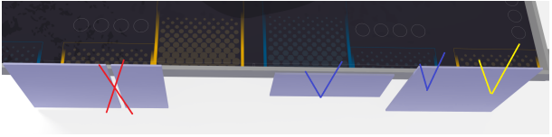
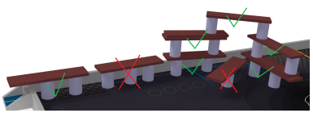

# Le robot principal

<model-viewer alt="ROBOT" src="./Meca/FichiersGLTF/ExportRobotUniWIP.glb" ar style="width:80%; height:400px" shadow-intensity="1" camera-controls min-field-of-view="2deg"></model-viewer>

## Les Objectifs

Le robot est le premier à effectuer des actions lors d'un match. Cette année on pouvait compter 2 actions principales :

La première était de déployer une banderole conçue par l'équipe, avec comme contrainte de se déployer à l'avant de la table définie par la couleur de notre équipe.

La seconde consiste à prendre des planches et des conserves placées précisément sur la table, afin de les amener dans une zone de construction définie pour construire des gradins d'un ou plusieurs étages.

À la fin du match, le robot doit terminer sa trajectoire dans une zone à l'arrière de la table définie encore une fois par la couleur de notre équipe.

## Contraintes

Le robot est autorisé à :

- Manipuler les éléments de jeux (conserves et planches).
- déployer une bannière embarquée.

Le robot n'est pas autorisé à :

- Nuire à l'adversaire.
- Détruire des constructions adverses.
- Voler des conserves dans la zone réservée à l'adversaire.
- Dépasser la hauteur maximale en dehors des zones de constructions.
  

