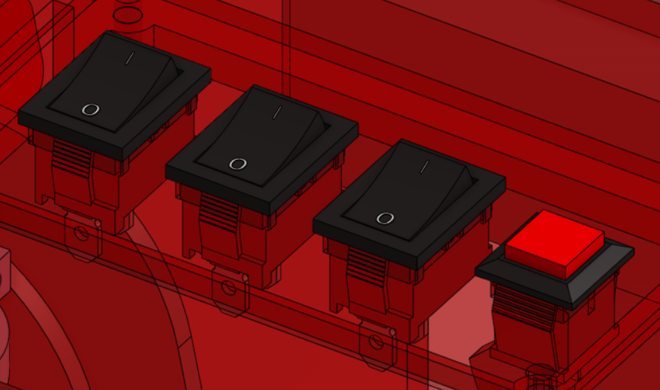

# La Stratégie 

Nous avons opté pour une **stratégie simple et fiable** nous permettant de marquer **46 points uniquement** avec le robot principal.

## L'initialisation
### Le positionnement

Pour notre robot, le **positionnement** est la partie la plus importante. En effet, celui-ci ne disposant d'aucun capteur permettant un retour sur sa position, le seul moyen fiable de le placer par rapport à la table n'est autre que la table elle-même.

En effet, le règlement nous met **3 min de préparation** à disposition sur la table. Pendant ce laps de temps, nous paramétrons notre robot grâce au **switch** ci-dessous en fonction de la stratégie, de la couleur, et nous activons le lidar obligatoire en match, mais désactivable pour les entrainements, ce qui nous permet de gagner beaucoup de temps.

Après cela nous déplassons les éléments de jeu, possitionnons notre robot dans le coin de notre équipe pour effectuer un recalage bordure qui consiste simplement à s'appuier sur deux coté de la table pour se fixer en x puis en y. Et voilà! Le robot et positionner dans la zone de départ 

### Préparation actionneur

Une fois le positionnement effectué nous plaçons la tirette ce qui met les actionneurs dans le position de départ nous permettant de placer la banderole dans la pince magnétique.

Et maintenant,... On attent,...

parfois,...ça peut durer,...looonnnnnngtemmmmmps,....

puis,...

**3....,**

**2....,**

**1.....,**

**partez!!!!**

## Le match

### La banderole 

Une fois le match lancé le robot, autonome on rappele, viens en premier lieu placer la banderole à cheval sur la bordure de la table venant assurer 20 points 

### Le premier gradin 

Après cela nous venons nous positionner dos au stock de matérielle le plus proche de notre zone de départ nous permettant retourner plusieur stels des manoeuvres dignes des meilleurs séries blayblade de nous afin de dépiler, déplacer, rempilerle stock de matériel pour enfin obtenir un gradin de niveau donc 4+8=12 points en plus.

### Le second gradin 

Tout ceci effectuer nous venonr recuperer un stock de matérielle brut sans perdre de temps à dépiler pour en déplacer le nécessaire et un peu plus pour un gradin que nous venons poser dans notre zone de départ et hop encore 4 points.

### La zone d'arrivée

Enfin, nous venons nous déplacer rapidement juste devant la zone d'arrivée en backstage, en marche arrière bras de pompe baissé, nous permettant avec la projection verticale de venir valider les 10 points de zone finale sans bloquer les PAMIs qui vont se déployer dans quelques secondes.

### Fin du matchs
Et voilà, c'est fini pour le robot principal. Si tout se passe bien, on finit avec 20+12+4+ 10 = 46 points juste avec le robot principal. Il reste cependant d'autres points à compter, notamment les points bonus liés à l'estimation et les points des PAMIs.

Une fois tous ces points comptés par les arbitres, nous pouvons confirmer et préparer notre robot pour le match suivant.