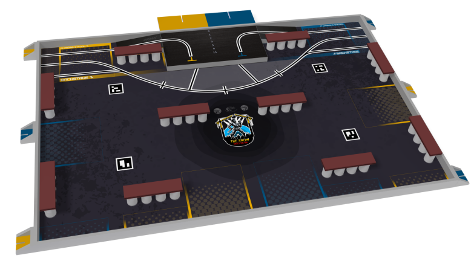
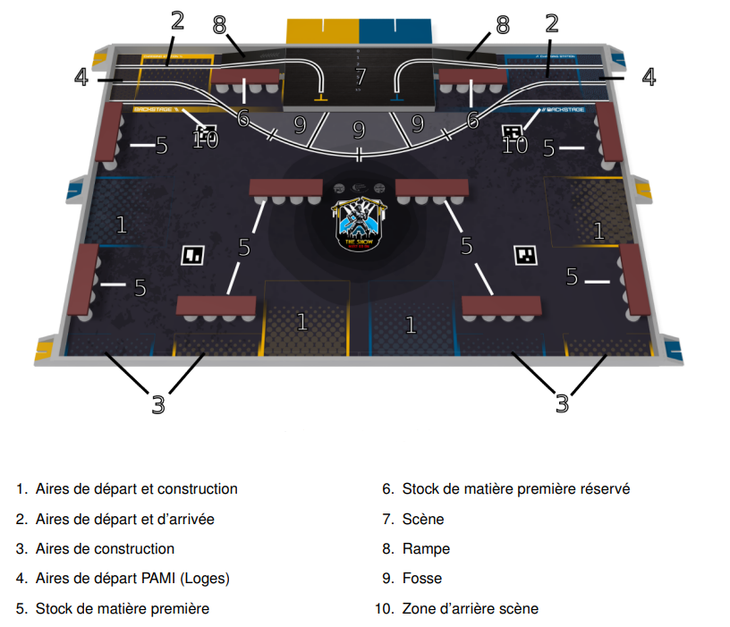

# La Coupe de France de Robotique

## Un événement unique
La **Coupe de France de robotique** (ou CRD) est un événement qui réunit chaque année des centaines d'équipes venues de toute la France pour faire concourir leurs robots passifs qu'elles ont passé un an à créer ou à adapter afin de répondre le mieux à un règlement qui évolue chaque année autour d'un thème, cette année le thème était **"The show must go on"** le but promouvoir un concert, en construire les gradin et faire le show face à son rival.

Ces robots doivent être entièrement **autonomes** et capables de réaliser différentes actions sur une table de 3 mètres par 2 en un temps limité, généralement 100 secondes. Le but est de marquer le plus de points possible en accomplissants différents objectifs. 

Chaque année nous avons donc droit à un nouveau visuel de la table ainsi qu'à de nouveau éléments de jeu cette année c'était **planche et conserve** et une petite **scène** pour les **PAMI** (voir la doc) 

## Une opportunité d'apprendre

### En s'amusant 

Cette compétition est **ouverte à tous**, que ce soit aux étudiants, aux clubs de robotique ou encore aux passionnés de technologie. Elle est organisée par Planète Sciences et permet aux participants de travailler sur un projet complet, mêlant **mécanique, électronique et programmation**. Les robots doivent être conçus, fabriqués et testés par les équipes elles-mêmes.

Mais la Coupe, ce n’est pas seulement une compétition technique. C’est aussi un moment de partage, de rencontres et de bonne ambiance. C’est l’occasion de **découvrir** les projets des autres, **d’apprendre** de nouvelles choses et de vivre une belle aventure en équipe.

### Et en se cassant la tête 

Participer à la Coupe de France de robotique permet de relever un vrai défi, de progresser dans de nombreux domaines et de vivre une expérience unique.

Pour bien comprendre l'envergure du challenge, il faut se pencher plus en détail sur les règles.

Eurobot 2025 impose un cadre technique, stratégique et logistique exigeant.

Chaque équipe doit concevoir un robot totalement autonome capable d’interagir avec des éléments du terrain dans un temps limité. Ses dimensions doivent être inférieures ou égales à 1200 mm en position repliée et inférieures ou égales à 1400 mm en position déployée. Toutes les normes de sécurité de base doivent être respectées, notamment en termes d’électricité.

De plus, un système anti-collision avec les robots adverses est obligatoire et doit être fonctionnel.

Le match, chronométré à 100 secondes, demande d’allier la rapidité et la coordination.

Les actions sont strictement encadrées : déplacement, collecte, positionnement d’objets, le tout sans contact avec l’adversaire comme détaillé ici :

La moindre erreur peut entraîner des pénalités, voire une disqualification. C’est un défi important qui repose sur notre esprit d’équipe et notre ingéniosité.

Ces règles sont à prendre en compte dès le début de notre réflexion, car notre robot doit passer ce que l'on appelle les homologations.

## L' homologation

Avant de pouvoir participer à son premier match, le robot ainsi que les PAMIs doivent passer toute une batterie de tests qu'il va devoir réussir pour être homologué. Cette homologation est divisée en deux parties :

– Une statique : vérification de la conformité dimensionnelle, les normes de sécurité.

– Une dynamique : le robot doit être capable de sortir de sa zone de départ et de réaliser une action en 100 s.

À savoir que toute modification effectuée une fois l'homologation passée doit être signalée au référé, suivie d'une nouvelle validation du robot.

Pour notre première participation nous avons réussi a être homologué dès le premier soir nous permettant de participer à tout nos matchs et de finir 59e au classement de la [CDR 2025] .

[UniWIP]: https://github.com/orgs/Unimakers/teams/uniwip
[CDR 2025]: https://www.coupederobotique.fr/edition-2025/
[Just The Docs]: https://just-the-docs.com/
[Jekyll]: https://jekyllrb.com

